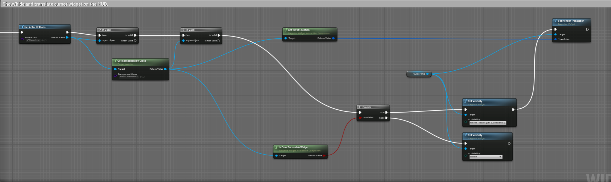

# Scene Sample

This sample demonstrates the usage of [Scene in Unreal Engine](https://developer.oculus.com/documentation/unreal/unreal-scene-documentation/). Though its main feature is related to Scene, it also uses a quad-layer to render an in-game menu with higher quality, works with audio, and provides a [Passthrough stereo layer](https://developer.oculus.com/documentation/unreal/unreal-passthrough-overview/).

When running on Quest, the sample application spawns Scene Anchors to populate a Scene Model which the user captured in Scene Capture Flow. In cases where the user has not yet used Scene Capture to capture a Scene Model, the sample will automatically launch Capture and prompt the user to capture a Scene Model. You can manually launch Capture from the in-game menu, exposing various functions related to the Scene Actor. The user can also spawn and throw balls that interact with the populated Scene Model. The sample also uses a Passthrough stereo layer so that the populated scene entities blend with the physical play area.


### Controls

* **Right B button:** Toggles the in-game menu.
* **Right Trigger:** Interacts with the in-game menu.
* **Left Grip:** Spawns a ball at the position of the left controller. Release the grip to throw the ball.
* **Right Grip:** Spawns a ball at the position of the right controller. Release the grip to throw the ball.

### In-Game Menu

Pressing the right controller’s B button will toggle the in-game menu. The in-game menu presents users with various options.

The top of the menu shows the status of the Scene Model:

* **Is Scene Populated:** Was a Scene Actor populated with the Scene Model?
* **Is Room Layout Valid:** Does the captured Scene Model have a valid room layout (at least four walls, a ceiling, and a floor)?

You can interact with menu widgets in the following ways:

* **Launch Scene Capture:** Launches Scene Capture. When you exit to return to the sample, the system will repopulate the Scene Actor to reflect any changes during Scene Capture.
* **Populate Scene:** Populates the Scene Actor. This option will be disabled if a Scene Actor is already populated.
* **Clear Scene:** Clears the currently populated Scene Actor. This option will be disabled if no populated Scene Actor exists.
* **Hide/Show All:** Toggles the visibility of all scene entities that make up the Scene Model.
* **Hide/Show Walls:** Toggles the visibility of wall scene entities.
* **Hide/Show Ceilings:** Toggles the visibility of ceiling scene entities.
* **Hide/Show Floors:** Toggles the visibility of floor scene entities.
* **Hide/Show Couches:** Toggles the visibility of couch scene entities.
* **Hide/Show Desks:** Toggles the visibility of desk scene entities.
* **Hide/Show Windows:** Toggles the visibility of window scene entities.
* **Hide/Show Doors:** Toggles the visibility of doors scene entities.
* **Hide/Show Others:** Toggles the visibility of “other” scene entities.
* **Passthrough Opacity:** Opacity slider for the Passthrough overlay.

### Ball Throwing Mechanics

You can spawn a physics-simulated ball by pressing and holding a controller’s grip button. The user releases the ball by releasing the grip button. The system plays a unique audio cue when it spawns a ball, when the ball bounces, and when the ball gets destroyed. Ball actors trace a line from their positions to the headset’s position in the world. If a ball actor detects that another actor in the Scene Model has occluded it, it will change its color using a dynamic material. This functionality is a helpful visual cue in cases where balls are behind hidden scene entities.


Ball actors occluded by a table (red) and ball actors on the table (gray).

## Implementation Details

### Scene Actor

The system places a [Scene Actor](https://developer.oculus.com/documentation/unreal/unreal-scene-documentation/#terminology) on the level. The following screenshot shows its details.


Most interactions with the Scene Actor occurs from the in-game menu's UMG in **Content > Blueprints > HUD**. For example, the following blueprint calls on the Scene Actor to launch Scene Capture when the user triggers the "On Clicked" event after pressing the "Launch Scene Capture" button in the menu:


The system may disable some menu buttons depending on the current state of the Scene Actor. For example, the **Populate Scene** button is disabled when a Scene Actor is already populated.


### In-Game UI

#### UI Stereo Layer

The in-game UI uses a quad-layer, which the Quest device’s compositor then composites. This functionality is crucial to ensure a high-quality visual output in the headset; otherwise, the UI will look severely aliased ([See the Stereo Layers documentation](https://docs.unrealengine.com/4.27/en-US/SharingAndReleasing/XRDevelopment/VR/VRHowTos/StereoLayers/)). Additionally, this allows the application to render the UI in front of the virtual scene.

This logic is in the HUDActor asset (**Content > Blueprints > HUDActor**). The actor uses a world-locked stereo layer. The actor also uses a Widget Component whose render target is the stereo layer.


#### Toggling the UI

Pressing the right controller's B button toggles the menu. When you toggle the menu to be visible, the system will move the menu in front of the user. You can find this logic in the level blueprint function "Toggle Hud."

#### UI Interaction

The VR Character Actor (**Content > Blueprints > VRCharacter**) has a Widget Interaction Component to interact with the menu. It also has a static mesh actor with a cylindrical mesh representing a controller's laser pointer. This static mesh actor is visible when the menu is currently active and when the Widget Interaction Component is not presently intersecting with the menu. The VR Character does this during its "Event Tick.”


Once the Widget Interaction Component intersects the menu, the UMG logic will translate a cursor icon over the menu. The UMG's "Event Tick" handles this logic (**Content > Blueprints > HUD**).



#### Ball Spawning & Destruction

Pressing a controller’s trigger will spawn a ball actor. You can find this logic in the “SpawnBall” blueprint function of the VR Character. The system uses a “MaxNumBalls” integer to cap the number of balls you can spawn. The system will destroy the oldest spawned ball actor if you reach this limit. The system also eliminates ball actors when they fall off the world using the “Kill Z” world setting.


The “SpawnBall” function also handles the throwing logic when the grip button is unpressed. Once the user throws a ball, the ball actor will begin to simulate physics.

#### Ball Actor Occlusion

The Ball Actor's "Event Tick" handles the trace logic to detect occlusion and change the dynamic material's properties (**Content > Blueprints > BallActor**).


#### Sound Cues

The system plays sound cues when a ball actor is spawned, destroyed, or collides with the environment. The Ball Actor handles this logic.


**NOTE:** You must properly set the correct sample rate in the project settings; otherwise, you can hear severe audio latency. To set the sample rate, navigate to **Project Settings -> Platform -> Android -> Audio -> Audio Mixer Sample Rate**. You must set this setting to 48000.


#### Passthrough Layer

The VR Character Actor is composed of a Passthrough Layer Component. This composition allows us to blend the Scene Model with the real world. For more information, consult the Passthrough layer documentation: [See the Unreal Passthrough Overview](https://developer.oculus.com/documentation/unreal/unreal-passthrough-overview/).

The in-game menu has a slider widget to control the Passthrough layer’s opacity. You can find this logic in the HUD actor (Content/Blueprints/HUD).


## How to Use

### Load the project

First, ensure you have Git LFS installed by running this command:
```sh
git lfs install
```

Then, clone this repo using the "Code" button above, or this command:
```sh
git clone https://github.com/oculus-samples/Unreal-Scene
```

### Launch the project in the Unreal Editor using one of the following options.

#### Epic Games Launcher with MetaXR plugin

The easiest way to get started is to use the prebuilt Unreal Engine from the Epic Games Launcher, with MetaXR plugin.

1. Install the [Epic Games Launcher](https://www.epicgames.com/store/en-US/download)
2. In the launcher, install UE5 (recommended).
3. Download and install the MetaXR plugin from the [Unreal Engine 5 Integration download page](https://developer.oculus.com/downloads/package/unreal-engine-5-integration).
4. Launch the Unreal Editor
5. From "Recent Projects", click "Browse" and select `Scene.uproject`

#### Meta fork of Epic’s Unreal Engine

The Meta fork of Epic’s Unreal Engine will give you the most up to date integration of Oculus features. However, you must build the editor from its source.

Follow the instructions on [Accessing Unreal Engine source code on GitHub](https://www.unrealengine.com/en-US/ue-on-github) to obtain:
- an Epic account
- a GitHub account
- authorization to access the Unreal Engine source repository
Disregard instructions on downloading Epic’s Unreal Engine source code as you will be building the Meta fork of Epic’s Unreal Engine source.

Make sure you have Visual Studio installed properly:
- Launch the Visual Studio Installer and click Modify for the Visual Studio version you want to use.
- Under the Workloads tab, click Game development with C++ if it isn’t checked and then click Modify.

1. Download the source code from the [Meta fork of Epic’s Unreal Engine on GitHub](https://github.com/Oculus-VR/UnrealEngine).
2. Follow Epic’s instructions on [Building Unreal Engine from Source](https://docs.unrealengine.com/5.2/en-US/building-unreal-engine-from-source/) to complete the process.
3. Launch the Unreal Editor
4. From "Recent Projects", click "Browse" and select `Scene.uproject`

Depending on your machine, the build may take awhile to complete.

# Licenses
The Meta License applies to the SDK and supporting material. The MIT License applies to only certain, clearly marked documents. If an individual file does not indicate which license it is subject to, then the Meta License applies.
